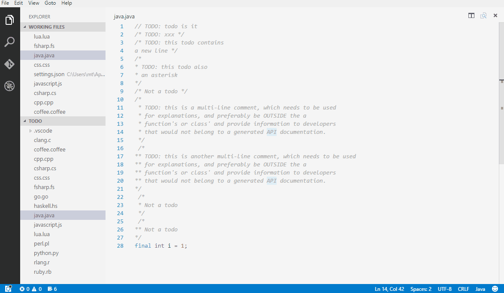

# VSCode TODO Parser Extension
[](https://marketplace.visualstudio.com/items?itemName=minhthai.vscode-todo-parser)
[](https://github.com/kantlove/vscode-todo-parser)

[](https://github.com/kantlove/vscode-todo-parser/issues)
[]()

Parse TODOs in your working files.



## Install
- Visit the Market [here](https://marketplace.visualstudio.com/items?itemName=minhthai.vscode-todo-parser).
- Or open VSCode, press **F1** then type this command `ext install vscode-todo-parser`. Press **Enter** to install.

## Usage
- Press __F1__ to open the command menu then select __Parse TODOs (all files)__ to parse code files inside the opened document.
- **Ctrl+Click** on file name in the output panel to jump to the TODO.
- The __TODO Counter__ on Status Bar will start automatically.
- Click on the __Counter__ to parse TODOs in the current document.

_Alternatively, in the **F1** command menu, select __Parse TODOs (current document)__ (see the demo above)_

_Note that for large projects, the result will be displayed gradually. You can see the progress at the bottom (the bolt icon :zap:). **Clicking on it will cancel the task**._
## Settings
Include the below snippet in your __User Settings__ (File > Preferences > User Settings).
```json
"TodoParser": {
  "exclude": ["cpp", "c"],
  "include": ["js"],
  "folderExclude": ["node_modules", ".vscode"],
  "markers": ["NOTE:", "REMINDER:"]
}
```
#### exclude
Set which __file extension__ you want to exclude. For example, `"exclude": ["cpp"]` will exclude all __*.cpp__ files from __Parse TODOs (all files)__.
#### include
Set which __file extension__ you want to include. If both **include** and **exclude** entry exist, **include** is prefered (ignore value of **exclude**).
#### folderExclude
Set which __folder__ you want to exclude. Allowed values are __folder names only__ (not directory path).
#### markers
Contains the words that signal the start of TODOs. For example, `"markers": ["NOTE:"]` will enable matching `NOTE: this is a new type of TODO`. 

*Note that "TODO:", "Todo:", and "todo:" are added by default.*


## What it does
- Display number of TODOs on your Status Bar

  

- Detect comments that start with "TODO:", "Todo:", "todo:".
- We support both single-line and multi-line comments. For example:

```java
// TODO: this todo is valid

/* TODO: this is also ok */

/* It's a nice day today
 *
 * Todo: multi-line TODOs are
 * supported too!
 */
```

## Supported languages
Java, Javascript, C#, C, C++, F#, Python, Ruby, Coffee Script, R, Haskell, Lua, Go, Perl, Markdown, Css, Scss, Less, Latex, Typescript, Elixir, Shell Script.

*Note that multi-line comment style is only supported in languages that have the syntax in the example.*

## Contribution
This is a small project by a passionate student so any contribution is welcome and loved :+1:


